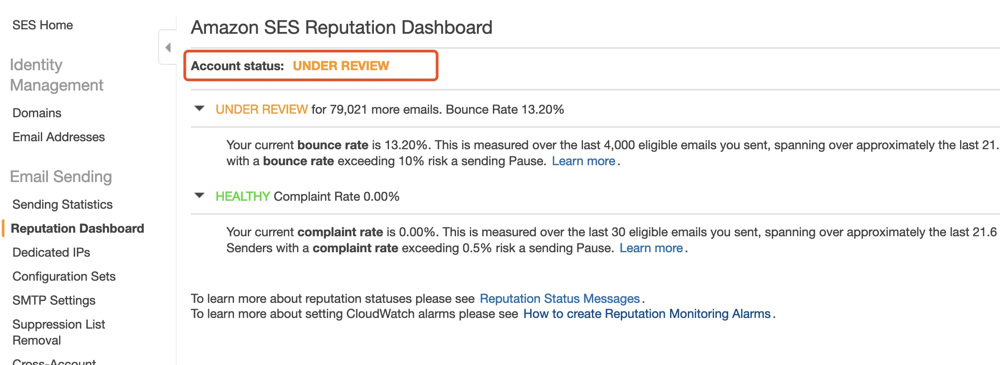

# SES Bounce Rate&Complaint Rate
---
# SES Bounce Rate&Complaint Rate

---
项目：
beauty-deal-service
beauty-deal-biz-service
---
目前提供给搜索的接口为：
BeautyStructureServiceImpl#loadAllBeautyDealTag(final List<DealTagArgs> dealTagArgs)

之前优化的wiki：http://wiki.sankuai.com/pages/viewpage.action?pageId=491621043
---
接下来可能的工作：
1. poi变更可能的影响
  >搜索接口有根据商户类别过滤团单类别的逻辑。
  美发（157）：从二级分类变为三级。跟产品确认中：
  如果已有的商户类别不会变更，只是新增的商户可能有新的类别，对目前搜索接口没有影响
  如果已有的美发商户可能改为养发健发，这个有一点影响。
  美甲（160）：分类和原来相同，无影响
  美容（158）：同美发
  即使有影响，代码调整不大，很快能够改好

---
2. 没有命中一级缓存的团单改为批量调用后端服务（稍复杂）
3. 当团单数据多的时候，后端全量内存缓存可能需要改为redis
